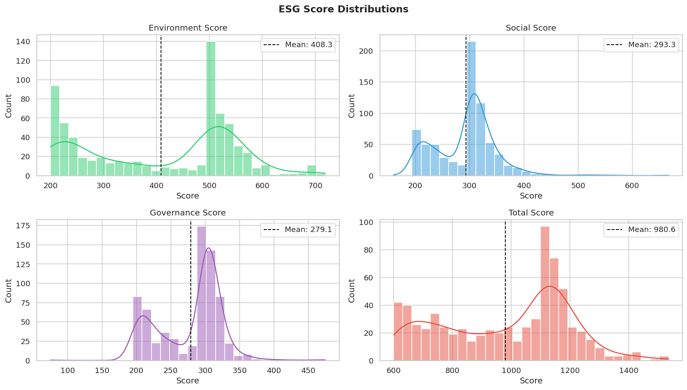

# Democratizing ESG: Predicting Corporate Sustainability Scores from Free Public Data

## Team

- Ethan Radecki (GitHub ID: 244611837)
- Caden Lippie (GitHub ID: 155611281)
- John Masseria (GitHub ID: 194737462)

## Introduction

Commercial ESG (Environmental, Social, and Governance) ratings from agencies like MSCI and Sustainalytics cost $5,000 to over $30,000 per year and cover roughly 10,000 companies worldwide. The methodologies behind these ratings are proprietary, which means that neither the investors paying for the data nor the companies being rated understand how their scores are calculated, this creates two problems. First, retail investors who want to align their portfolios with personal values are priced out of the data entirely, and second, most public companies remain unrated and invisible to the growing pool of ESG-focused capital. The global ESG asset market exceeds $30 trillion, and yet the majority of market participants lack access to the information needed to participate in it.

Our project addresses this gap by building a machine learning pipeline that predicts corporate ESG scores using only freely available public data. In the United States, all public companies must file annual 10-K filings with the Securities and Exchange Commission (SEC). These filings contain comprehensive business information including risk disclosures, management discussion, and financial statements. For this project, we chose to extract text from three key sections of these 10-K filings, generate financial sentiment and keyword features using FinBERT (a finance-specific language model), and supplement these with structured financial fundamentals pulled from the SEC EDGAR XBRL API. The combined feature set feeds into an ElasticNet regression model, with coefficients and SHAP values providing feature-level explanations for every prediction. The pipeline solely uses freely available public data, which means there's no proprietary feeds, no prior ESG ratings, and no cost barrier.

This project is a proof of concept rather than a production-ready system. Our best single-target result is a Social pillar R² of 0.215, and our models cannot predict Governance scores at all from the 10-K text and financial fundamentals alone, which is a finding that we frame as a structural ceiling confirming that governance scores require external data sources that do not appear in annual 10-K filings. These results are modest compared to prior research, but those studies typically relied on financial ratios or prior ESG scores as model features, which are either expensive or self-reinforcement mechanisms for the scores being predicted. Instead of providing a production-ready solution, our contribution is methodological, since we are able to demonstrate that free publicly available data can extract interpretable ESG signals and a transparent machine learning pipeline can partially replicate what commercial providers charge thousands of dollars a year for. For our primary stakeholders, which are retail investors, this establishes a foundation that future work could extend with additional data sources to improve predictive performance while maintaining the transparency and accessibility that commercial ratings lack.

## Literature Review

Environmental, social, and governance (ESG) ratings are quantitative assessments that professional agencies assign to companies based on their performance in environmental, social, and governance fields. The major agencies that assign these scores include MSCI, Sustainalytics, Refinitiv, and S&P Global. These agencies use proprietary methodologies to analyze publicly available data, such as annual company reports and sustainability disclosures[^1][^2]. Each agency evaluates a company's exposure to material ESG risks that are relevant to their industry, and then assesses the quality of the management systems the company has in place to address those risks. For example, MSCI covers over 10,000 companies across the globe and assigns relative ratings from AAA to CCC based on weighted assessments across 35 key ESG issues[^1]. Access to these ratings requires subscriptions that can range from $5,000 to over $30,000 annually, with higher level services demanding even higher fees[^3]. Despite their widespread adoption by asset managers and institutional investors, the specific calculations, weightings, and transformations that determine these ratings remain proprietary.

Despite ESG ratings widespread use in financial markets, the ratings themselves face significant limitations related to accessibility and reliability. A 2021 study completed by the CFA Institute found that correlations between major ESG ratings providers fall below 50%, suggesting that the same company can receive significantly different ratings depending on the evaluating agency[^4]. In contrast, credit ratings, another common practice in the financial industry, consist of correlations between agencies of over 94%. Aside from the major inconsistency, the proprietary nature of these methodologies creates a "black box" issue, where neither companies nor investors understand how these scores are calculated. Allianz Global Investors, a major asset manager, acknowledged these concerns as a critical limitation and developed its own ESG rating system to provide explainability and accountability[^5]. Additionally, the cost barriers create even more access problems. Subscriptions priced in the thousands of dollars per year effectively exclude retail investors from accessing ESG data, while the limited coverage means the vast majority of public companies remain unrated and invisible to ESG-focused investors.

Recent research shows that ML models can effectively predict ESG scores using various data sources. Multiple studies have shown that models incorporating financial data and textual analysis achieve accuracy scores of over 80%[^6][^7]. For example, a 2024 study using BERT-based NLP models achieved an ESG classification accuracy of 80.79%[^6], while another study reported an R² of 0.979 using stacked ensemble ML approaches[^7]. A key technology for this work has been FinBERT, a finance-specific language model that significantly outperforms general-purpose NLP models for financial text analysis tasks[^8]. FinBERT has been applied successfully to financial sentiment analysis and ESG classification tasks, emphasizing the viability of using NLP techniques to extract meaningful insights from corporate disclosures.

However, most existing research relies on either financial ratios or prior ESG ratings as primary predictors. The high performance figures from those studies reflect the strength of those features and signals they provide. Financial ratios capture company fundamentals that correlate with ESG investments and prior ESG ratings are somewhat of a self-reinforcement mechanism for the scores that are being predicted. There has been limited exploration of predicting ESG scores directly from raw text of regulatory filings without these additional features.

Our approach builds on the foundations laid above but departs from prior work in two different ways. First, for this project we made it a necessity that only freely available data was used, which led us to both the SEC 10-K filings and the EDGAR financial fundamentals, instead of proprietary data or prior ESG scores. These choices deliberately remove the cost barrier entirely and avoid the self-reinforcement issue with utilizing prior ESG scores for model predictions. Second, we paired FinBERT text features with ElasticNet regression rather than the ensemble methods common in prior studies. This decision was driven by a finding during model selection, which is that when you have 323 companies and 108 features the dataset will exhibit sparse signals with most features so many will carry little weight within the training process but still be included to make predictions. ElasticNet was the right choice to handle these sparse signals since its L1 regularization drives irrelevant features to exactly zero, which produced more stable cross-validated performance than XGBoost across all four ESG targets. The ElasticNet coefficients themselves are intuitive and useful for drawing actionable decisions from the model, but SHAP explainability was combined to further emphasize the importance of transparency and explainability so that stakeholders could understand which disclosure patterns and financial characteristics drive the predictions - educating their investment strategies.

Our primary stakeholders are retail investors, which are individual investors that manage their own portfolios and who increasingly want to align their investment strategies with personal values but cannot afford institutional ESG data subscriptions. A secondary stakeholder group consists of small and mid-cap public companies that currently lack ESG scores and need insight into how they perform relative to industry peers. By providing free, explainable ESG score predictions derived from solely publicly available data, this work addresses the accessibility and transparency gaps that existing commercial scores leave open.

## Data and Methods

### Data

#### ESG Ratings

Our target labels come from a Kaggle ESG ratings dataset aggregating scores from a major commercial rating provider for companies in the S&P 500 and adjacent indices as of 2022. The dataset contains 709 companies with four score dimensions:

- **Total score** (0–1000): composite ESG rating
- **Environment score** (0–1000): emissions, climate risk, natural resources
- **Social score** (0–1000): labor practices, human rights, community relations
- **Governance score** (0–1000): board structure, executive compensation, shareholder rights

Score distributions show a characteristic bimodal structure in the environment pillar, with a cluster boundary near 500, which is a pattern documented in prior literature as a disclosure threshold artifact where companies crossing minimum reporting standards receive systematically higher scores. This theory was attempted to be tested using different sources of data. One of those tests was to examine EU ESG scores due to the mandandated reporting across all companies. Additionally pre-2020 scores where given the benift of the doubt on non-reported metrics which was changed in April 2020 to assign non-reported metrics with zero's instead. Both of these data spurces were attempted to be investigated, however data was unaccesible.

*Figure 1: **Environment Score** is bimodal with two distinct peaks around 200 to 220 and 500 to 520, suggesting two clusters of companies: low and high environmental performers with few in the middle. **Social Score** is more right-skewed with a sharp peak around 300, while also maintaining some bimodality. **Governance Score** is the most normally distributed of the three pillars, with a tight cluster around 280 to 310 and a mean of 278.8, with slight bimodality persisting. **Total Score** is also bimodal with peaks around 1050 to 1100. The bimodality remains withing industries and cannot be fully explained by data we were able to find.* 

The dataset covers 11 GICS industry sectors with significant imbalance, Industrials and Financials together represent over 35% of the sample.

*The Kaggle dataset is not included in this repository due to size constraints. It can be accessed at https://www.kaggle.com/datasets/tonylm00/business-companies-dataset?select=raw.csv.*

#### SEC 10-K Filings

Annual 10-K filing text was retrieved via the SEC EDGAR API (`sec-edgar-downloader` Python library) for FY2021 filings, timed to precede the 2022 ESG ratings. Three narrative sections were extracted per filing:

- **Item 1 — Business**: company operations, products, and markets (~67,600 characters average)
- **Item 1A — Risk Factors**: material risks facing the company (~123,100 characters average)
- **Item 7 — MD&A**: management discussion of financial results (~96,000 characters average)

Of 709 ESG-rated companies, 332 had complete 3-section extractions. A quality audit (`work/10-K_filings_extraction_quality_check.ipynb`) identified 9 critical bad-extraction companies (XBRL financial tag contamination or table-of-contents stubs extracted in place of prose) and removed them, yielding **323 companies** for modeling.

#### SEC Financial Fundamentals

FY2021 balance-sheet and income-statement data was retrieved via the SEC EDGAR Company Facts XBRL API for all 323 companies. Five log-transformed features were retained after a multicollinearity reduction pass: total assets, public float, net income, operating income, and debt-to-assets ratio. Industry-median imputation was applied for the 14 companies missing specific line items.

---

### Methods

#### Feature Engineering Pipeline

The final model used approximately 130 features across eight groups:

**FinBERT Sentiment Features** (76 features): Each 10-K section was chunked into sentences, up to 300 per pillar (raised from an initial cap of 100 after an EDA finding that 68–79% of Social and Governance sentences were hitting the cap). FinBERT scored each sentence as positive, negative, or neutral. Per-section aggregates retained: mean positive/negative/neutral probability, positive-to-negative ratio (clipped at the 99th percentile), net sentiment score, and sentence count. This yields 18 features per section × 3 sections plus 6 document-level aggregates. Zero-variance features were dropped.

**Keyword Frequency Features** (14 features): Term frequency of predefined ESG keyword groups (emissions, governance, social, sustainability, etc.) per section, log-transformed (log(1 + x)) to compress the heavy-tailed distribution.

**SEC Financial Fundamentals** (5 features): Log-transformed scale features capturing company size, a known correlate of ESG rating magnitude.

**Document Structure Features** (4 features): Section-level document length indicators from the extracted JSON.

**Extended Structural Features** (21 features): Per-section Flesch-Kincaid readability grade (via `textstat`), quantitative density (numeric token mentions per 1,000 words), uncapped sentence count, average sentence length, and section-length bucket flags. Derived cross-section features include total word count, mean FK grade, and an MD&A quantitative density flag. Top correlations with total score: business sentence count (r = 0.20), business word count (r = 0.17), mean FK grade (r = 0.14).

**Mode Probability Feature** (1 feature, `mode_prob_high`): A depth-3 DecisionTree classifier was trained on the training split to predict whether a company falls in the "high environment" mode (score ≥ 500), reflecting the bimodal threshold structure. Rather than hard mode assignment (which degraded performance — see Results), the classifier's continuous probability output was used as a soft feature. The classifier was fit on training data only before the train/test split to prevent label leakage.

**Industry One-Hot Encoding** (38 features): GICS sector and subsector dummies encoding industry membership, capturing large between-industry variance in ESG scores that text features alone cannot recover.

#### Approaches Evaluated but Not Used in Final Model

**TF-IDF / LSA Semantic Features**: A TF-IDF (2,000 features, bigrams, sublinear_tf) → TruncatedSVD (50 components) pipeline was built and evaluated as a non-FinBERT semantic complement (`work/tfidf_lsa_features.ipynb`). Adding 50 LSA components caused a regularization cascade: ElasticNet raised alpha to compensate for the additional noisy dimensions, suppressing genuine signal features. Environment test R² fell from +0.019 to −0.227 when LSA was included. LSA features were excluded from the final model. Finding: document topic patterns from 10-K vocabulary do not improve ESG score prediction beyond FinBERT sentiment at this dataset scale.

**Hard Mode-Split Modeling**: A two-stage pipeline was evaluated (`work/mode_split_modeling.ipynb`): classify each company into a high/low environment mode with a depth-3 DecisionTree, then fit separate ElasticNetCV models per mode. Oracle results using true mode labels showed genuine within-mode signal (environment R² = +0.74, total R² = +0.60), confirming that the bimodal structure is real and learnable in principle. However, the mode classifier achieved only 61.5% accuracy on the test set, barely above the 52% class-balance baseline. Using predicted modes degraded all targets by −0.21 to −0.53 R² relative to the single-model baseline due to misassignment applying the wrong model to an entire segment of companies. Hard mode-split was not used; the `mode_prob_high` soft feature was adopted instead.

#### Model Selection

Four regression models were compared across all four ESG targets using a consistent 80/20 train/test split and 5-fold cross-validation (`work/Feature_Extraction_and_Modeling.ipynb`, `work/model_comparison_and_grade_classifier.ipynb`):

| Model | Total CV R² | Notes |
|-------|-------------|-------|
| ElasticNetCV | +0.194 | Best across all targets; automatic alpha/l1_ratio selection |
| LassoCV | +0.186 | Similar to ElasticNet; slightly less stable on correlated industry features |
| XGBoost | +0.084 | Overfits on 323-company dataset; CV R² degrades with tuning |
| Ridge | −0.025 | Cannot perform feature selection; all 108 features remain active |

ElasticNet was selected as the final model due to it's CV R² value and it's ability to deal with high dimensional data. ElasticNet also acts as a form of dimensionality reduction technique and mitigates multi-colinearity issues.

#### Training and Evaluation

The final model used `ElasticNetCV` (5-fold CV, 100 alpha values, 10 l1_ratio values, max_iter = 10,000) trained on the 80% training split (n = 256 companies). Features were scaled with `StandardScaler` fit on training data only, as ElasticNet is scale-sensitive. Final evaluation used the 20% holdout test set (n = 67 companies). 5-fold CV R² was computed as an additional reference, but it is upward-biased because alpha selection uses the same folds — test R² is the unbiased performance estimate.

---

### Supporting Files

All supporting Jupyter notebooks are in the `work/` directory. A full index with detailed descriptions is maintained in `work/README.md`. Summary below:

**Data Collection**

| Notebook | Purpose |
|----------|---------|
| `10-K_filings_data_pull.ipynb` | Downloads and extracts Business, Risk Factors, and MD&A sections from SEC EDGAR 10-K filings |
| `10-K_filings_extraction_quality_check.ipynb` | Audits extraction quality; flags 9 critical failures (XBRL contamination, TOC stubs) for removal |
| `structured_features_collection.ipynb` | Fetches FY2021 financial fundamentals from SEC EDGAR Company Facts XBRL API |

**Exploratory Data Analysis**

| Notebook | Purpose |
|----------|---------|
| `EDA_ESG.ipynb` | ESG score distributions, industry composition, pillar correlations, grade distributions |
| `EDA_10-K_filings.ipynb` | FinBERT feature validation, sentence cap floor-effect analysis, within-industry bimodality, UMAP/PCA visualization |
| `EDA_Structured_Features.ipynb` | Company size vs. ESG score analysis; bimodal threshold investigation |

**Feature Engineering and Modeling**

| Notebook | Purpose |
|----------|---------|
| `Feature_Extraction_and_Modeling.ipynb` | Main pipeline: FinBERT extraction (300-cap), feature engineering, four-model comparison, ablation experiments |
| `structural_features_extended.ipynb` | Extracts Flesch-Kincaid readability, quantitative density, and document-structure features |
| `tfidf_lsa_features.ipynb` | TF-IDF → LSA semantic features (evaluated; excluded from final model) |
| `mode_split_modeling.ipynb` | Oracle vs. predicted mode-split experiment; evaluates two-stage bimodal modeling |
| `hyperparameter_tuning.ipynb` | XGBoost RandomizedSearchCV and RidgeCV alpha tuning |
| `model_comparison_and_grade_classifier.ipynb` | Unified model comparison across targets; grade conversion; class-weighted grade classifier |
| `shap_explainability_analysis.ipynb` | SHAP explainability for XGBoost across all four ESG targets |

**Final Model Evaluation**

| Notebook | Purpose |
|----------|---------|
| `final_model_validation.ipynb` | Final ElasticNet holdout evaluation: 323 companies, ~130 features, all four targets. Coefficient plots, feature group contribution chart, industry R² breakdown, grade confusion matrix |

---

## Results

### Holdout Test Performance

The table below reports results from the held-out 20% test set (n = 67 companies) and 5-fold CV on the training set. All four ESG targets show positive test R², a meaningful improvement over earlier model iterations in which governance and environment were effectively at zero.

| Target | CV R² | Test R² | MAE | RMSE | Alpha | L1 Ratio | Non-zero Features |
|--------|-------|---------|-----|------|-------|----------|-------------------|
| total_score | 0.247 | 0.062 | 145.91 | 172.82 | 16.63 | 0.99 | 20 |
| environment_score | 0.311 | 0.019 | 103.76 | 119.93 | 11.43 | 0.99 | 17 |
| social_score | **0.142** | **0.215** | 30.87 | 39.30 | 4.75 | 0.95 | 27 |
| governance_score | −0.008 | 0.006 | 36.43 | 42.81 | 6.41 | 0.99 | 2 |

**Interpreting error in original units**: ESG total scores span roughly 200–900, with an interquartile range of approximately 300 points. A total-score RMSE of 172.82 represents roughly 40–60% of the typical score range — the model identifies direction and rough tier but is not precise enough for investment-grade scoring. Social scores have a narrower IQR (~150 points); the social RMSE of 39.30 is a similar relative error, consistent with the stronger R².

The l1_ratio of 0.99 across nearly all targets means the signal is near lasso optimal and the model is behaving more like a Lasso regression model while retaining a small (1%) component of Reidge regularization. This means the model is more agressive when selecting features and works well with this high dimensional use case.

### Feature Importance

The non-zero ElasticNet coefficients (Figure 2) reveal the following patterns:

- **Environment** (17 features): Company size dominates — `log_total_assets` and `log_public_float` carry the largest positive coefficients. Larger companies consistently receive higher environment scores, reflecting both greater disclosure resources and rater methodology that rewards comprehensive reporting. The `mode_prob_high` soft split feature has a positive coefficient, confirming that the bimodal threshold structure contributes signal even when handled softly. FinBERT environment-pillar sentiment from Risk Factors contributes a smaller positive signal.

- **Social** (27 features): The most distributed feature set. FinBERT social-pillar sentiment from Business and MD&A sections contributes alongside structured financial features and readability indicators. Mean Flesch-Kincaid grade shows a negative coefficient — less readable filings predict lower social scores, potentially capturing lower disclosure elaborateness in social program language.

- **Governance** (2 features): Only 2 non-zero features selected. This is not a modeling failure but a data availability finding. Governance scores are primarily driven by board composition, director independence, executive compensation ratios, and shareholder rights provisions — all disclosed in proxy statements (Form DEF 14A), not 10-K filings. The model correctly identifies this data gap through near-zero coefficient selection.

- **Cross-target shared features** (Figure 3): Industry dummies for Energy, Utilities, and Healthcare appear across multiple targets. These encode baseline sector-level ESG score differences unrelated to individual company disclosure quality.

### Industry-Level Performance

The industry R² heatmap (Figure 4) shows heterogeneous performance. Energy and Utilities show stronger environment signal — these sectors have more standardized emissions and climate-risk disclosure language, creating a cleaner FinBERT signal. Healthcare shows stronger social signal, consistent with extensive labor and patient-care language in their 10-K filings. Financial sector performance is weak across all pillars, likely because financial-sector ESG depends heavily on portfolio holdings and governance structures not captured in 10-K text.

Additional results including residual plots, per-industry breakdown tables, and grade-prediction confusion matrices are available in `work/final_model_validation.ipynb`. SHAP explainability analysis for the XGBoost comparison model is available in `work/shap_explainability_analysis.ipynb`.

---

## Discussion

Our primary goal was to demonstrate that freely available SEC 10-K text carries statistically meaningful ESG signal that can be extracted at low cost. The social pillar result (test R² = 0.215) substantiates this claim — a retail investor using this pipeline would have meaningful directional signal about a company's social performance, with a mean absolute error of approximately 31 points on a score dimension with a ~150-point IQR. The model is best understood as a screening tool: useful for filtering companies into rough ESG tiers, not a replacement for commercial ratings.

The environment result (test R² = 0.019) is weaker than the social result despite showing higher CV R² (0.311). The oracle mode-split experiment sheds light on why: within-mode environment R² reaches +0.74, showing the signal is genuinely learnable once the bimodal threshold is correctly handled. The bottleneck is mode classifier accuracy (61.5%), which is only marginally above the 52% class-balance baseline. The environment score is partially a classification problem — companies either have crossed the disclosure threshold or they have not — and linear regression is poorly suited for this without a reliable mode indicator.

The governance finding is a meaningful methodological contribution. The model selected only 2 features for governance prediction and achieved near-zero R² on the holdout. This definitively confirms that 10-K filings do not contain the governance signals that commercial raters use. Board composition, director independence, executive compensation structure, and shareholder voting records are disclosed in proxy statements, not annual reports. Any future effort to predict governance scores using free public data must incorporate proxy statement NLP.

Regarding the stakeholder connection: the pipeline is fully open-source and uses only freely available data. A retail investor could run this pipeline to obtain a free directional ESG estimate for any public company filing with the SEC. However, investment-grade accuracy (typically implied by commercial R² values of 0.6–0.8) is not achieved, and the model should not be used as a substitute for professional ESG analysis for high-stakes investment decisions.

---

## Limitations

**Dataset scale**: 323 companies is small for a machine learning task with approximately 130 features. ElasticNet's sparse feature selection partially compensates, but the 67-company test set creates noisy holdout estimates. A single cluster of unusual companies in the test set can shift R² substantially. Results should be interpreted as approximate directional evidence rather than precise performance guarantees.

**Label noise**: ESG ratings from different providers correlate at only 0.54–0.61 with each other[^4]. Our model is trained against one provider's 2022 scores. R² against a noisy label has a theoretical ceiling below 1.0 even with a perfect model, making direct comparison to studies using different target labels misleading.

**Temporal snapshot**: The dataset is a cross-sectional 2022 snapshot. The model has not been tested across time. ESG rating methodology evolves annually, and a model trained on 2022 ratings may not generalize to current ratings for the same companies.

**CV R² bias**: Reported CV R² values are upward-biased because alpha selection and cross-validation use the same training data. Test R² on the 67-company holdout is the unbiased estimate, but is itself noisy at this sample size. True performance likely falls between the two figures.

**Industry and size imbalance**: The dataset skews toward large-cap companies in Industrials, Financials, and Consumer sectors. Generalization to under-represented sectors (Real Estate, Utilities) and to small-cap companies is untested.

**Governance structural ceiling**: Governance is not predictable from 10-K text and financial fundamentals. This is a data availability constraint, not a modeling limitation, and cannot be resolved without incorporating proxy statement data.

---

## Future Work

**Improved environment mode classification**: The oracle mode-split result (environment R² = +0.74) shows the environment signal is learnable within modes. Improving the mode classifier — potentially by incorporating disclosure-volume features or environmental keyword density as a proxy for voluntary reporting — could meaningfully improve environment performance.

**Proxy statement integration**: Adding Form DEF 14A (proxy statement) NLP would directly address the governance data ceiling. Proxy statements contain board composition, director independence flags, executive compensation tables, and shareholder proposal language — the exact signals governance scores are built on.

**Expanded training set**: SEC EDGAR contains 10-K filings for thousands of public companies. Expanding beyond the 323 ESG-rated companies via semi-supervised learning could improve model robustness and reduce sensitivity to the small holdout sample.

**Temporal validation**: Testing the pipeline on 2023 and 2024 filings against updated ESG ratings would assess temporal generalization and identify whether annual score drift reduces model applicability over time.

**Richer text representations**: Fine-tuned sentence-level ESG classifiers — trained on labeled ESG-specific sentences rather than general financial sentiment — could outperform FinBERT as the text feature backbone. Section-level embeddings from a larger language model could capture topic interactions that per-sentence FinBERT aggregation misses.

---

## References

[^1]: MSCI, "MSCI ESG Ratings Methodology," 2024. https://www.msci.com/documents/1296102/34424357/MSCI+ESG+Ratings+Methodology.pdf

[^2]: Sustainalytics, "ESG Risk Ratings Methodology Abstract - Version 3.1," June 2024. https://www.sustainalytics.com/docs/knowledgehublibraries/default-document-library/sustainalytics_-esg-risk-ratings_-version-3-1_-methodology-abstract_-june-2024.pdf

[^3]: MSCI ESG Research LLC, "Form ADV Part 2A," March 2017. https://www.msci.com/documents/1296102/1311232/ESG+ADV+2A+2017-03.pdf

[^4]: CFA Institute, "ESG Ratings: Navigating Through the Haze," August 2021. https://blogs.cfainstitute.org/investor/2021/08/10/esg-ratings-navigating-through-the-haze/

[^5]: Allianz Global Investors, "ESG ratings - are they still relevant?" 2025. https://www.allianzgi.com/en/insights/outlook-and-commentary/sustainable-investing-esg-ratings-are-they-still-relevant

[^6]: PMC, "ESG2PreEM: Automated ESG grade assessment framework using pre-trained ensemble models," 2024. https://pmc.ncbi.nlm.nih.gov/articles/PMC10884917/

[^7]: MDPI Forecasting, "Predicting ESG Scores Using Machine Learning for Data-Driven Sustainable Investment," January 2025. https://www.mdpi.com/2813-2203/5/1/7

[^8]: Huang, A., Wang, H., & Yang, Y., "FinBERT: A Large Language Model for Extracting Information from Financial Text," Contemporary Accounting Research, January 2023. https://onlinelibrary.wiley.com/doi/10.1111/1911-3846.12832

[^9]: King, A., "Public Company ESG Ratings Dataset," Kaggle, March 2024. https://www.kaggle.com/datasets/alistairking/public-company-esg-ratings-dataset
